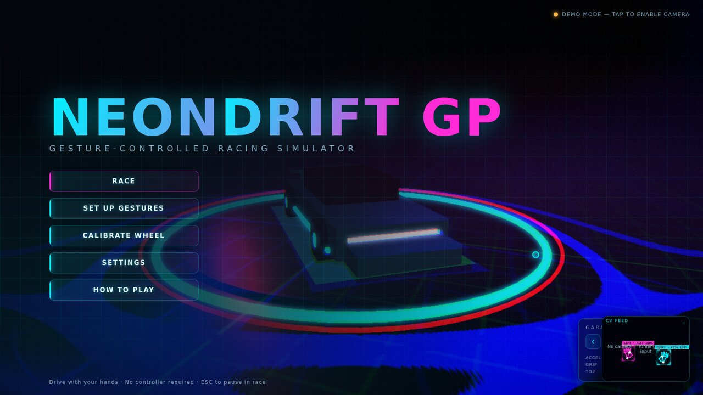
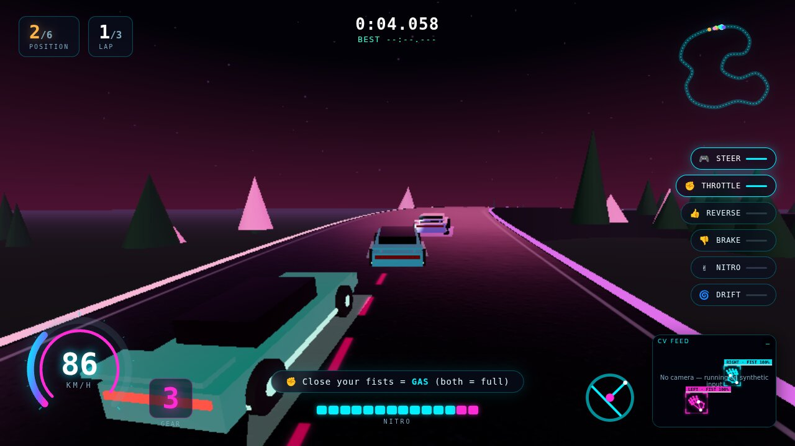

<div align="center">

# 🏎️ NEONDRIFT GP

### Gesture-controlled 3D racing simulator — drive with your hands and a webcam

[](https://github.com/Krishna-44/neon-drift-/actions/workflows/ci.yml)


[](LICENSE)

**[▶ Live demo](https://krishna-44.github.io/neon-drift-/)** ·
**[⬇ Download for Windows](https://github.com/Krishna-44/neon-drift-/releases/latest/download/NEONDRIFT-GP-Setup.exe)** ·
[Architecture](docs/ARCHITECTURE.md) ·
[Gesture guide](docs/GESTURES.md) ·
[Roadmap](docs/ROADMAP.md)



No controller. No keyboard required. Hold an invisible steering wheel in the air and drive.

</div>

## Highlights

- **Real-time computer vision** — MediaPipe Hand Landmarker tracks 21 landmarks per hand in a Web
  Worker, so inference never blocks rendering; One-Euro filtering plus velocity prediction keep
  steering smooth *and* responsive.
- **Gesture recognition that doesn't flicker** — rotation-invariant hand features, a pose cascade
  and temporal hysteresis; the test suite checks ≥95 % accuracy over 200 noisy trials and that
  alternating-noise streams never chatter.
- **Personalised controls** — record your own pose for each driving action; live hands are
  classified by weighted nearest-centroid against your recordings, with an explicit idle class so a
  relaxed hand never fires an action.
- **Real vehicle simulation** — deterministic 120 Hz fixed-step physics with a slip-angle tyre
  model, weight transfer and handbrake drifting; AI opponents drive the same car model using
  Stanley path tracking.
- **Engineered like a product** — strict TypeScript, 80+ unit and integration tests (including an
  end-to-end headless race), performance benchmarks, an adaptive-quality governor, CI, and an
  Electron desktop build.

---

## What this is

NEONDRIFT GP turns your webcam into a motion controller. A computer-vision pipeline tracks both
hands at camera frame-rate, a gesture engine reads an *invisible steering wheel* plus a set of
driving gestures, and a real slip-angle vehicle simulation turns that into arcade-precise driving —
all rendered in a neon/cyberpunk 3D world with AI opponents, four tracks, drifting, nitro, replays,
and spectator/telemetry support.

It is built as a **modular, production-grade architecture**, not a demo: a deterministic fixed-step
simulation core, a CV thread separated from the render thread, 80+ automated tests, performance
benchmarks, an adaptive-quality governor, and a multiplayer-ready telemetry transport.

> **Plays without a camera too.** If no webcam/permission is available, the game drops into a
> synthetic "ghost driver" demo and the full keyboard fallback — so it is always runnable.



---

## Controls

| Gesture | Action |
|---|---|
| ✋ ✋ Both hands up like a wheel | **Steer** — the line between your hands *is* the wheel; rotate to turn |
| ✊ Fist | **Throttle** — one fist = strong, both fists = full gas |
| 👍 Thumb **up** | **Reverse** gear |
| 👎 Thumb **down** | **Brake** (both thumbs = max brake) |
| ✌️ Peace / V sign | **Nitro** boost |
| 👎 + hard turn | **Drift** (handbrake) |
| ✋ Open palm held 2 s | **Pause** |
| ☝️ Point + pinch | **Menu navigation** (gesture cursor) |

Every driving gesture can be re-recorded with your own pose via **Set Up Gestures**.

**Keyboard fallback:** `↑/W` throttle · `↓/S` brake · `←→/AD` steer · `Space` drift · `Shift` nitro ·
`R` reverse · `C` camera · `V` record · `H` perf HUD · `Esc` pause.

---

## Play now

- **Windows desktop app:** download
  **[NEONDRIFT-GP-Setup.exe](https://github.com/Krishna-44/neon-drift-/releases/latest/download/NEONDRIFT-GP-Setup.exe)**
  and run it — it installs the game and adds a desktop shortcut. The app is unsigned, so if Windows
  SmartScreen warns, click **More info → Run anyway**. All versions are on the
  [Releases page](https://github.com/Krishna-44/neon-drift-/releases).
- **In the browser:** open the **[live demo](https://krishna-44.github.io/neon-drift-/)** in Chrome
  or Edge, click **Enable Camera** (or **Use Demo + Keyboard**), then **Race**.
- **From source:** `npm install && npm start` (opens http://localhost:5173).

> Camera access needs `https://` or `localhost` — opening `index.html` straight from disk won't work.

---

## Quick start

```bash
# 1. install (also copies the MediaPipe WASM runtime into public/)
npm install

# 2. (optional) pre-download the hand model for fully-offline play (~7.8 MB)
npm run setup

# 3. run the dev server
npm run dev          # → http://localhost:5173

# Desktop build (Electron)
npm run desktop      # builds + launches the native window

# Tests / benchmarks
npm test             # 80+ unit + integration tests
npm run bench        # per-frame performance benchmarks
```

Open the page, allow camera access, hit **Race**, and hold up your hands. First time? Run
**Calibrate Wheel** so the wheel centre and steering range match *your* body.

### Custom assets (optional)

- **Reflections:** `npm run setup` downloads a CC0 neon HDRI from Poly Haven into
  `public/hdri/env.hdr`. When present it drives scene reflections; otherwise the game uses a
  procedural neon environment.
- **Your own car:** put a glTF binary at `public/models/car.glb`. It replaces the procedural body
  of the player and showroom car, auto-scaled to about 4.3 m long and facing +Z; the neon lights,
  wheels and nitro effects stay.

---

## Architecture

The codebase is split into engine-agnostic **logic** (pure TypeScript, fully unit-tested, no DOM/GL)
and **presentation** (Three.js, DOM, WebAudio). The same logic runs in the browser, in headless
tests, and could run on a server for authoritative multiplayer.

```
src/
├── core/            Engine primitives — no game knowledge
│   ├── MathUtils      clamp/lerp/damp, One-Euro helpers, seeded RNG, RollingStats
│   ├── GameLoop       fixed-timestep sim (120 Hz) + interpolated render
│   ├── EventBus       typed pub/sub used between every layer
│   ├── StateMachine   validated screen/flow transitions
│   ├── Settings       persistent, schema-versioned profile + calibration
│   ├── Profiler       FPS / CV / input-latency instrumentation
│   └── PerfGovernor   adaptive quality ladder (auto-scales for weak GPUs)
│
├── vision/          Computer-vision pipeline  (CV thread)
│   ├── CameraManager  webcam auto-detect, FPS pacing, dynamic res, low-light boost
│   ├── visionWorker   MediaPipe HandLandmarker off-thread (GPU→CPU fallback)
│   ├── HandTracker    worker/inline orchestration, role association, occlusion coast
│   ├── HandFeatures   rotation-invariant per-hand features
│   ├── GestureClassifier  pose cascade + temporal hysteresis (anti-flicker)
│   ├── OneEuro        One-Euro filters (low-latency jitter removal)
│   └── SyntheticHands scripted ghost-driver source (demo + headless tests)
│
├── input/           Input translation
│   ├── GestureMapper  HandsState → car inputs (wheel math, deadzone, expo, prediction)
│   ├── KeyboardInput  analogue-feel keyboard fallback
│   ├── Calibration    3-step calibration session logic
│   ├── CustomGestures gesture-training (centroid + cosine matching)
│   └── GestureCursor  fingertip cursor + pinch-to-click for menus
│
├── physics/         Vehicle + world simulation (deterministic)
│   ├── VehicleDynamics  slip-angle tyre model, weight transfer, drift, nitro, gearbox
│   └── TrackPhysics     surface sampling, wall/runoff resolution, car-vs-car contacts
│
├── track/           Procedural circuits (data, not assets)
│   ├── Spline         arc-length Catmull-Rom, projection, curvature, slope
│   ├── TrackData      the four shipped tracks
│   └── TrackBuilder   procedural meshes, themed skies/lights, instanced props
│
├── ai/              Opponents + race control
│   ├── AIDriver       Stanley path-tracking, corner-speed planning, rubber-band
│   └── RaceDirector   checkpoints, laps, standings, wrong-way detection
│
├── vehicle/CarFactory     procedural neon car mesh + physics→visual binding
├── camera/CameraRig       chase / cockpit / cinematic rig, speed-FOV, shake
├── audio/AudioEngine      fully synthesised engine/skid/collision/nitro/UI/music
├── fx/                     instanced particles (smoke/spark/nitro) + bloom PostFX
├── net/                    telemetry transport (BroadcastChannel + WebSocket) & spectator
├── game/                   GameSession orchestrator, App shell, Telemetry, Replay, Recorder, AdaptiveProfile
└── ui/                     neon HUD, menus, calibration/training wizards, webcam skeleton overlay
```

### Threading & latency

```
 webcam frame ─► ImageBitmap ─► [CV Worker] MediaPipe ─► landmarks
                                                            │
   render thread ◄── GameSession ◄── GestureMapper ◄── HandTracker
        │                  ▲              (One-Euro + velocity prediction)
        └─ Three.js + bloom└─ 120 Hz fixed-step physics (interpolated)
```

- **CV runs in a Web Worker** — inference never blocks a draw call (with an inline fallback if
  workers/WASM are unavailable, and a watchdog that fails over if the worker stalls).
- **One-Euro filtering + velocity prediction** compensate for camera latency so steering is smooth
  *and* responsive (adaptive cutoff: heavy smoothing at rest, tight tracking on fast turns).
- **Fixed-step physics with render interpolation** keeps the simulation deterministic (hence
  testable) and stable at any display refresh.

### Anti-flicker gesture stabilisation

Gestures must persist N frames to activate and disagree M frames to release (hysteresis), with a
sliding-window confidence vote. This is what stops controls from chattering — verified by tests that
fire alternating-noise streams and assert the output never flickers.

---

## Performance

Measured with `npm run bench` (per-call wall time; the whole game-logic budget runs every frame):

| Hot path (per frame/tick) | Mean time |
|---|---|
| `extractFeatures` (1 hand) | ~0.003 ms |
| `classifyPose` | ~0.0004 ms |
| One-Euro landmark smoothing (21 pts) | ~0.018 ms |
| `GestureMapper.update` (full) | ~0.002 ms |
| `VehicleDynamics.step` (1 car) | ~0.002 ms |
| **Full field tick — 8 cars + AI + track + collisions** | **~0.11 ms** |

The entire per-frame game-logic cost is well under **0.2 ms**, leaving the full ~16 ms frame budget
for the GPU. The **PerfGovernor** auto-scales pixel ratio / bloom / particles to hold 60 FPS on weak
hardware. Targets met: **<50 ms input latency, 60+ FPS, GPU-accelerated rendering & CV.**

---

## Features

- **Four procedural tracks** — Neon District (walled city), Dune Rush (open desert), Midnight Run
  (night highway), Sakura Pass (mountain drift), each with its own theme, lighting, props, elevation.
- **Real vehicle dynamics** — slip-angle tyres, longitudinal weight transfer affecting grip,
  traction-limited drive, handbrake drifting, surface grip (sand/grass), slope gravity, virtual
  6-speed gearbox driving the engine note.
- **AI opponents** — Stanley-controller path tracking on a precomputed racing line, curvature-based
  braking points, overtaking, hairpin recovery, and rubber-band balancing that scales *target speed*,
  never the physics (AI drives the exact same car model you do).
- **Adaptive driving assistant** — learns your skill/smoothness/aggression across races and tunes AI
  difficulty + steering assists for you (toggleable).
- **Gesture training mode** — record a custom pose and bind it to nitro/pause/camera.
- **Replay & recording** — cinematic trackside replay of the last race, plus one-key `.webm` capture
  with your webcam burned into the corner.
- **Spectator / telemetry** — open `?spectate=1` in a second tab to watch live, or run the bundled
  zero-dependency relay (`npm run relay`) to spectate across machines. The wire format is the seam a
  future authoritative multiplayer server plugs into.
- **Live 3D showroom dashboard** — the main menu renders a real-time orbiting camera around a
  showcase car on a neon grid podium (same renderer + bloom as the game), with 3D-tilt menu buttons.
- **YOLO-style tracking monitor** — the corner webcam screen draws detection-style corner-bracket
  boxes around each hand with `ROLE · POSE confidence%` label tags plus the full landmark skeleton,
  so you always see exactly what the tracker sees. Visible in menus *and* in-race.
- **Guided onboarding** — a first-run "Drive With Your Hands" card before your first race, rotating
  control hints during the countdown and opening laps, and a "show both hands" warning whenever
  tracking loses you mid-race.
- **Asphalt-grade road shading** — multi-octave aggregate texture with bump + roughness maps,
  tyre-wear darkened lanes, worn edge lines and neon centre dashes.
- **Neon/cyberpunk UI** — animated menus, glitch title, speedo/RPM arc, live gesture chips, minimap,
  and an FPS/latency debug readout.

See [`docs/ARCHITECTURE.md`](docs/ARCHITECTURE.md) and [`docs/GESTURES.md`](docs/GESTURES.md) for
deep dives, and [`docs/ROADMAP.md`](docs/ROADMAP.md) for the multiplayer/VR extension plan.

---

## Testing

```bash
npm test            # unit + integration (vitest)
npm run typecheck   # strict TypeScript, no emit
npm run bench       # performance benchmarks
npm run desktop:smoke   # Electron headless self-test (synthetic race, exits 0/1)
```

**80+ tests** cover: feature extraction & classification (incl. 200-trial noisy accuracy ≥95 %),
anti-flicker stabilisation, One-Euro filtering, the full gesture→control mapping, vehicle dynamics
(acceleration, braking, drift, reverse, grip, 60 s fuzz with no NaN), spline/track math, wall &
car-vs-car collisions, AI full-lap completion on every track, the race director (lap/checkpoint/
shortcut rejection/wrong-way), adaptive profiling, and an **end-to-end headless race** that drives
the real pipeline from synthetic hands all the way to a finished race.

---

## Tech stack

- **Rendering:** Three.js (r0.180) — procedural geometry, custom threshold-bloom post pipeline.
- **Computer vision:** MediaPipe Tasks-Vision `HandLandmarker` (GPU delegate, CPU & inline fallbacks).
- **Language:** TypeScript (strict), ES modules.
- **Audio:** Web Audio API — 100 % synthesised, no sound files.
- **Build:** Vite. **Desktop:** Electron. **Tests:** Vitest.
- **Net:** native WebSocket + a hand-rolled zero-dependency relay server.

> **Design decision — why a web stack instead of Unity/Unreal?** The goal was the best stack for
> real-time, CV-driven gameplay that *runs locally on Windows*. MediaPipe's first-class web runtime + Three.js gives a single, dependency-light, fully-inspectable
> codebase that runs in the browser **and** ships as a native Electron app — with the CV model and
> game logic in the same language, no engine licence, and no multi-GB editor install. The simulation
> core is engine-agnostic, so a Unity/Unreal front-end could consume the same gesture/telemetry
> stream over the existing WebSocket transport.

---

## Browser support

Needs a Chromium-based browser (Chrome/Edge) or the Electron build for the WebGL2 + WASM-SIMD + Web
Worker stack MediaPipe uses. Camera access requires `https://` or `localhost` (both `npm run dev` and
the Electron shell satisfy this).

---

## Contributing

Issues and pull requests are welcome — see [`CONTRIBUTING.md`](CONTRIBUTING.md).

## License

MIT — see [`LICENSE`](LICENSE).

## Author

Built by **Krishna** — [@Krishna-44](https://github.com/Krishna-44).
